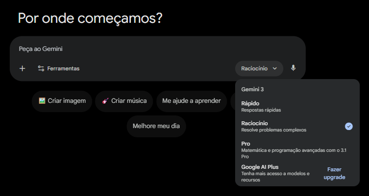
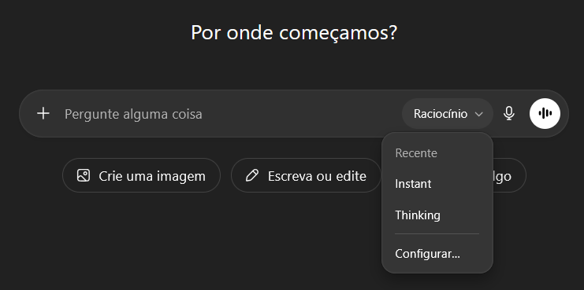
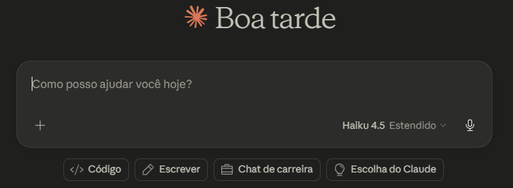

# Procedimentos Executados para Construir o Curso do Claude

## O que vamos fazer?

Criar um curso sobre a ferramenta [Claude](https://www.claude.ai), em especial, sobre a ferramenta de Desktop que possui três módulo: "ChatBox", "Coworks" e "Code".

Acesso no [link](https://claude.com/download).

## Abordagem

Utilizando a abordagem "For Dummies" solicitamos ao Gemini um promp base para isso:

## Passo 1 — Definir contornos

### Gemini

Configure o modelo para **"racioncícinio"**, utilizando o plano gratuito da ferramenta, como mostrado abaixo:

  
  
 Página inicial 

### Prompt Gemini 1

Utilizando o prompt abaixo, chegamos a um novo prompt, melhor estruturado e com parâmetro mais claros para o resultado inicial do curso alcançar um resultado melhor.

![[passos/prompt-1]]

### Retorno Gemini 1

O prompt retornado:

![[return-1]]

## Passo 2 — Versão 1

O prompt retornado na fase anterior depende de um contexto, no caso, um artigo fornecido pela própria claude com título "Claude Code on desktop: 'Get started with the desktop app'" disponível em [link](https://code-claude-com.translate.goog/docs/en/desktop-quickstart?_x_tr_sl=en&_x_tr_tl=pt&_x_tr_hl=pt&_x_tr_pto=tc&_x_tr_hist=true), acessado 1 de maio de 2026. 

> Para fins de acesso local, vide o arquivo [anexo-1.md](anexo-1.md).

### Prompt ChatGPT 1

De posse do [prompt-1](#retorno-gemini-1) e anexo, adicionando o artigo ao envio dessa solicitação, utilizaremos a ferramenta ChatGPT, em sua versão paga para termos acesso ao modelo de "raciocínio", conforme ilustração abaixo:

  
  
 Página inicial 

### Retorno ChatGPT 1

Ele gerou um total de 20 aulas e mais 5 seções auxiliares ao corpo do curso, como apresentação e encerramento, em um total de 1344 linhas utilizando o formato markdown[^1]. Vide o arquivo com o resultado completo em [curso-v1-gpt.md](passos/curso-v1-gpt.md).

> [^1] [link](https://www.markdownguide.org)

## Passo 3 — **Instruções** para Análise dos Resultados

De posse do [curso versão 1.0](#retorno-chatgpt) solicitamos novamente ao Gemini um prompt para analisar o criticamente o resultado o ChatGPT.

### Prompt Gemini 2

Utilizando o prompt abaixo, chegamos a um novo prompt, melhor estruturado e com parâmetro mais claros para o favorecer melhores resultados durante a análise crítica do curso gerado.

![[passos/prompt-2]]

### Retorno Gemini 2

O prompt retornado:

![[return-2]]

## Passo 4 — Análise dos Resultados

De posse do grupo de instruções desenvolvido no [tópico anterior](#retorno-gemini-2) e do [curso versão 1.0](#retorno-chatgpt) construído pelo ChatGPT, vamos iniciar o passo 4.

### Claude

  
  
 Página inicial 

Utilizando o próprio Claude, em um plano pago, vamos inserir os dados citados e aguardar o retorno.

### Retorno Claude 1

Conforme solicitado no corpo [prompt-2](#retorno-gemini-2), formulado pelo Gemini, foi compilado o arquivo [ANALISE_CRITICA_CLAUDE_DESKTOP.md](passos/ANALISE_CRITICA_CLAUDE_DESKTOP.md) (ao clicar no nome do arquivo poderá ver o resultado completo).

Possui um total de 483 linhas com descrição inicial e 7 capítulos abordando elementos positivos e negativos do [curso versão 1.0](#retorno-chatgpt).

## Passo 5 — "Instruções" para Aprimorar a versão 1.0

De posse do [ANALISE_CRITICA_CLAUDE_DESKTOP.md](passos/ANALISE_CRITICA_CLAUDE_DESKTOP.md) solicitamos, mais uma vez, ao Gemini um prompt, agora, para aperfeiçoar a versão 1.0 do curso utilizando a avaliação realizada pelo Claude.

### Prompt Gemini 3

Utilizando o prompt abaixo, chegamos a um novo prompt, melhor estruturado e com parâmetro mais claros para ajudar a enriquecer os resultados da versão 1.0 com aspectos analisados durante o passo anterior.

![[passos/prompt-3]]

### Retorno Gemini 3

O prompt retornado:

![[return-4-0]]

## Passo 6 — Aprimoramento a versão 1.0

De posse do grupo de instruções desenvolvido no [tópico anterior](#retorno-gemini-3) vamos iniciar o passo 6.

### Claude

Retornando a plataforma da ferramenta Claude, dentro do contexto (char que já utilizamos) em que foi criada a [ANALISE_CRITICA_CLAUDE_DESKTOP.md](passos/ANALISE_CRITICA_CLAUDE_DESKTOP.md), vamos enviar o [prompt-3](#retorno-gemini-3).

### Retorno Claude 2

Conforme solicitado no corpo [prompt-3](#retorno-gemini-3), formulado pelo Gemini, foi compilado o arquivo [novo-roteiro-curso.md](passos/novo-roteiro-curso.md) (ao clicar no nome do arquivo poderá ver o resultado completo).

## Passo 7 — "Instruções" para construir Método para avaliar a Carga Horária do curso

Neste passo vamos solicitar ao Gemini que nos ajude a avaliar a estrutura e o conteúdo do Curso que acabamos de formular.

### Prompt Gemini 4

Note que, diferente da primeira avaliação aqui vamos amostrar aleatóriamente duas aulas do curso gerado para avaliar estruturas e semelhanças e assim elaborar uma metodologia para avaliar a Carga Horária do curso.

![[prompt-4]]

### Retorno Gemini 4

O prompt retornado:

![[return-4-0]]

## Passo 8 — Método para avaliar a Carga Horária do curso

No passo anterior construímos o [prompt-4](#retorno-gemini-4) este foi submetido em um chat novo da ferramenta ChatGPT. Durante o envio desse prompt foram anexadas duas aulas a citar, os módulos 1 e 14, em através do arquivo [anexos-2-aulas-amostragem.md](passos/anexos-2-aulas-amostragem.md) (que o leitor pode conferir no link clicavel).

### Retorno ChatGPT 2

O ChatGPT retornou o arquivo [return-4-5.md](passos/return-4-5.md) (que o leitor pode conferir no link clicavel) do qual foi retirada a tabela abaixo:

  ![[tabela-tempo-atividade]]

## Passo 9 — "Instruções" para avaliar a Carga Horária do curso

Neste passo vamos solicitar ao Gemini que nos ajude a formular o prompt para solicitar a avaliação do arquivo [novo-roteiro-curso.md](passos/novo-roteiro-curso.md) utilizando como referência a [tabela-tempo-atividade.md](passos/tabela-tempo-atividade).

### Prompt Gemini 5

Através da iteração entre as IA's retornamos ao gemini apenas com a tabela dos tipos de elementos, sua descrição, tempo médio mínimo esperado e justificativa pedagógica. E solicitamos:

![[prompt-5]]

### Retorno Gemini 5

O prompt retornado:

![[return-5]]

## Passo 10 — Avaliar a Carga Horária do curso

De posse do [prompt-5](#retorno-gemini-5) vamos envia-lo junto com a [tabela-tempo-atividade.md](passos/tabela-tempo-atividade) para o Claude, dentro do mesmo chat que utilizamos para todos os envios desse relato procedimental.

### Retorno Claude 2

Com base nas informações enviadoas o Claude retornou o arquivo [carga-horaria.md](passos/carga-horaria.md) (que o leitor pode conferir no link clicavel).